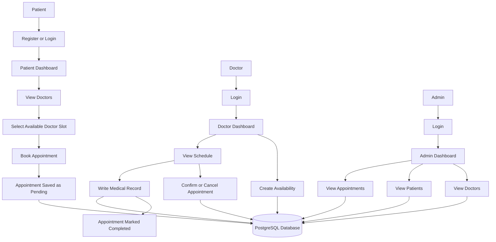
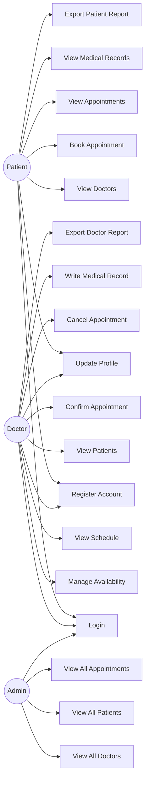
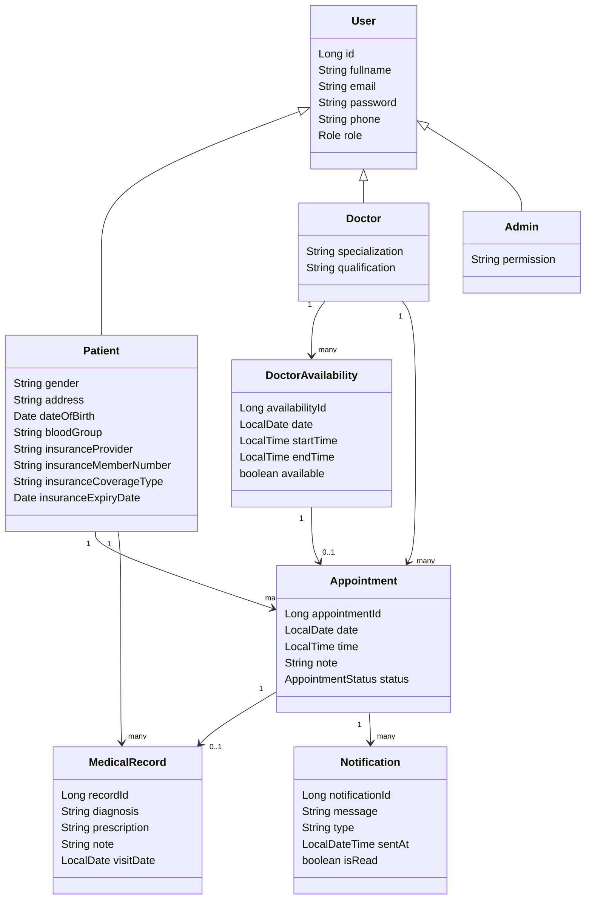
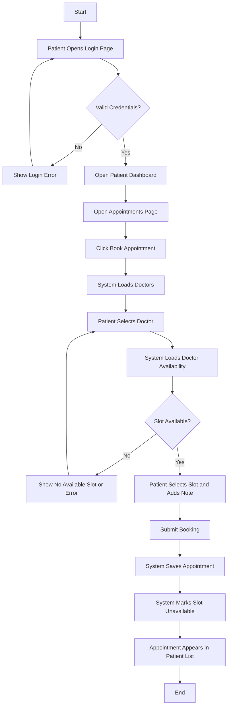
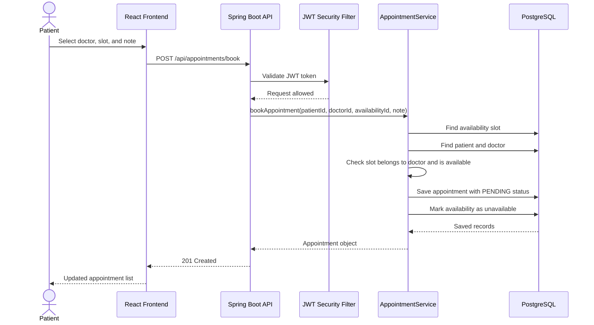
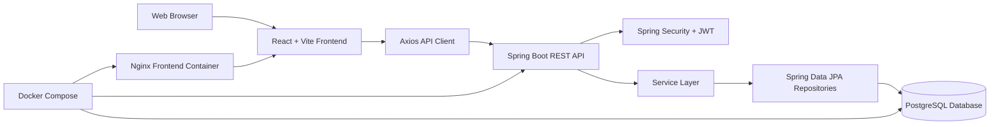

# Legacy Clinic Digital Healthcare Appointment and Medical Records Management System

## Submission Report

### Topic and Case Study

**Topic:** Digital Healthcare Appointment and Medical Records Management System  
**Case Study:** Legacy Clinic  
**Proposed System Name:** Legacy Clinic Healthcare Management System, implemented in this repository as the DHAMS healthcare prototype.

Legacy Clinic is a healthcare facility that provides outpatient consultation services through doctors, patients, and administrative staff. The proposed system supports the clinic by digitizing patient registration, doctor availability, appointment booking, medical record handling, profile management, role-based access, reports, Docker deployment, and version control evidence.

The implemented prototype uses:

- **Frontend:** React, Vite, JavaScript, Axios, reusable page components.
- **Backend:** Java 21, Spring Boot, Spring Security, JWT, Spring Data JPA.
- **Database:** PostgreSQL.
- **Deployment:** Docker and Docker Compose.
- **Version Control:** Apache Subversion (SVN) documentation and setup.

---

## Phase 1: System Analysis and Design

### 1. General Description and Analysis of Legacy Clinic

Legacy Clinic handles daily activities such as registering patients, managing doctors, scheduling appointments, recording consultation outcomes, and allowing users to view relevant healthcare information. In a manual or poorly digitized environment, these processes are often slow, repetitive, and difficult to audit. Patients may need to call or physically visit the clinic to know doctor availability. Doctors may manage schedules separately from patient records. Administrators may struggle to get a complete overview of doctors, patients, and appointments.

The proposed system provides a centralized web-based platform for three main users:

- **Patients** create accounts, log in, update profiles, book appointments, view appointments, view medical records, and export reports.
- **Doctors** create accounts, log in, manage availability slots, view schedules, view assigned patients, write medical records after consultations, and export reports.
- **Administrators** view doctors, patients, appointments, and clinic activity summaries.

The system improves Legacy Clinic operations by making appointment scheduling faster, reducing double booking, improving medical record availability, and supporting secure role-based access to sensitive clinic information.

### 2. Functional Diagram: Internal Working of Legacy Clinic



### 3. Problem Statement

Legacy Clinic faces operational problems caused by fragmented and manual management of appointments, patient information, doctor schedules, and consultation records. The main problems are:

- Patients cannot easily see available doctor slots before booking.
- Appointment booking can be slow and may depend on phone calls or physical visits.
- Doctors may not have a clear digital schedule of upcoming consultations.
- Booked and available slots may be confused, causing scheduling conflicts.
- Medical records may be difficult to retrieve quickly during follow-up visits.
- Administrators may lack a single dashboard for doctors, patients, and appointments.
- Reports may require manual preparation, making decision-making slower.
- Sensitive health information needs proper authentication and role-based protection.

The proposed system solves these problems by providing one secure digital platform for registration, login, appointment scheduling, availability management, medical records, reports, and administrative monitoring.

### 4. Object Oriented System Analysis and Design

#### 4.1 Use Case Diagram



#### 4.2 Class Diagram



#### 4.3 Activity Diagram: Appointment Booking



#### 4.4 Sequence Diagram: Patient Books Appointment



#### 4.5 Component Diagram



---

## Phase 2: Software Development Prototype

### 1. Prototype Summary

The developed prototype is an experimental working version of the Legacy Clinic healthcare system. It is designed to validate core concepts before full production deployment. The prototype is not a complete hospital information system; it focuses on the essential workflows needed by a clinic:

- user registration and login;
- patient dashboard;
- doctor dashboard;
- administrator dashboard;
- doctor availability management;
- appointment booking;
- appointment status tracking;
- patient medical record viewing;
- doctor medical record creation;
- insurance profile capture;
- report viewing and CSV export;
- seeded database responses for demonstration.

### 2. Prototype Screens, Forms, Buttons, Menus, and Layout

The frontend is organized as a React single-page application with separate pages for each role:

| Area | Implemented Screens |
| --- | --- |
| Public | Landing page, login page, registration page |
| Patient | Dashboard, appointments, medical records, reports, profile |
| Doctor | Dashboard, schedule, availability, patients, reports, profile |
| Admin | Dashboard, doctors, patients, appointments |

Important prototype UI elements include:

- Login form with email, password, show/hide password button, sign-in button, and error banner.
- Multi-step registration form for patient and doctor accounts.
- Patient appointment booking modal with doctor selector, availability selector, note field, cancel button, and confirm booking button.
- Doctor availability form with date, start time, end time, add slot button, and delete slot button.
- Navigation layouts for patient, doctor, and administrator portals.
- Dashboards and lists that simulate real clinic operations using database-backed seeded records.

### 3. Input Processing

The prototype processes input through React forms and Spring Boot REST endpoints:

- Login details are submitted to `POST /api/auth/login`.
- Patient registration uses `POST /api/auth/register/patient`.
- Doctor registration uses `POST /api/auth/register/doctor`.
- Appointment booking uses `POST /api/appointments/book`.
- Doctor availability uses `POST /api/doctors/{doctorId}/availability`.
- Patient profile updates use `PUT /api/patients/{patientId}`.
- Doctor profile updates use `PUT /api/doctors/{doctorId}`.
- Medical record creation uses `POST /api/appointments/{id}/record`.

The frontend stores the JWT token and user details in `localStorage`. Axios adds the JWT token to protected requests using an authorization header.

### 4. Basic Workflows

#### Patient Journey

```text
Register or Login -> Patient Dashboard -> Appointments -> Book Appointment -> View Appointments -> View Records -> Export Report -> Logout
```

#### Doctor Journey

```text
Register or Login -> Doctor Dashboard -> Add Availability -> View Schedule -> Confirm/Cancel Appointment -> Write Medical Record -> Export Report -> Logout
```

#### Admin Journey

```text
Login -> Admin Dashboard -> View Doctors -> View Patients -> View Appointments
```

### 5. Simulated Database Responses

The backend includes seed data support through the `seed` Spring profile. When Docker Compose starts the backend with `SPRING_PROFILES_ACTIVE=seed`, the database can be populated with demonstration users, doctors, patients, appointments, medical records, insurance details, and notifications.

Demo accounts documented in the repository include:

| Role | Email | Password |
| --- | --- | --- |
| Admin | `admin@dhams.com` | `Admin@123` |
| Doctor | `nadine.keza@dhams.com` | `Doctor@123` |
| Doctor | `eric.ntwali@dhams.com` | `Doctor@123` |
| Patient | `vanessa.ishimwe@dhams.com` | `Patient@123` |
| Patient | `jean.nkurunziza@dhams.com` | `Patient@123` |

### 6. Programming Best Practices

The project follows good programming practices appropriate for Java, Spring Boot, JavaScript, and React:

- Meaningful names such as `AppointmentService`, `DoctorAvailability`, `MedicalRecordService`, `PatientController`, and `AuthResponse`.
- Layered backend design separating controllers, services, repositories, DTOs, entities, and configuration.
- Controllers are responsible for HTTP endpoints.
- Services contain business rules.
- Repositories handle database persistence.
- DTOs define request and response structures.
- Passwords are encoded using BCrypt.
- JWT authentication is used for stateless access.
- CORS is configured for frontend-backend communication.
- React pages are organized by user role.
- Axios is centralized in `frontend/src/api/axios.js`.
- Repeated UI primitives are separated into reusable components.
- Dockerfiles use multi-stage builds to reduce runtime image size.

### 7. Selected Design Pattern

**Selected design pattern:** Repository Pattern.

The Repository Pattern is used to separate business logic from data access. Instead of writing SQL directly inside controllers, the system uses Spring Data JPA repository interfaces.

Examples:

- `AppointmentService` uses `AppointmentRepo`, `AvailabilityRepo`, `PatientRepo`, and `DoctorRepo`.
- `PatientService` uses `PatientRepo`, `AppointmentRepo`, and `MedicalRecordRepo`.
- `DoctorService` uses `DoctorRepo`, `AvailabilityRepo`, `AppointmentRepo`, and `UserRepo`.
- `AuthService` uses `UserRepo` for account lookup and persistence.

This pattern improves maintainability because database queries are isolated in repository classes while business rules remain in service classes.

The system also follows a layered MVC-style architecture:

```text
React Views -> REST Controllers -> Services -> Repositories -> PostgreSQL
```

---

## Phase 3: Dockerization and Version Control

### 1. Process to Dockerize the Application

Dockerizing the Legacy Clinic application involves packaging the frontend, backend, database, and dependencies so the system runs consistently on different machines.

The general process is:

1. Identify application components: React frontend, Spring Boot backend, and PostgreSQL database.
2. Create a backend Dockerfile that builds the Java application and runs the generated JAR.
3. Create a frontend Dockerfile that builds the React application and serves it through Nginx.
4. Configure Nginx to serve frontend files and proxy API calls to the backend.
5. Create a Docker Compose file to run frontend, backend, and database together.
6. Configure environment variables for database connection and server port.
7. Expose required ports.
8. Add a database volume to preserve PostgreSQL data.
9. Build and run the containers.
10. Verify the frontend and backend in the browser.

### 2. Docker Implementation

The repository includes:

- `backend/Dockerfile`
- `frontend/Dockerfile`
- `frontend/nginx.conf`
- `docker-compose.yml`

Docker Compose services:

| Service | Image/Build | Purpose | Port |
| --- | --- | --- | --- |
| `db` | `postgres:17` | PostgreSQL database | `5432` |
| `backend` | `./backend/Dockerfile` | Spring Boot API | `8081` |
| `frontend` | `./frontend/Dockerfile` | React app through Nginx | `8082` |

Commands:

```powershell
docker compose build
docker compose up
```

Application URLs:

```text
Frontend: http://localhost:8082
Backend API: http://localhost:8081
Frontend API proxy: /api
```

### 3. Version Control System: SVN

The selected Version Control System for assignment evidence is **Apache Subversion (SVN)**.

SVN is used to track source code, documentation, Docker configuration, and project files. The documented setup uses Slik Subversion on Windows.

Repository structure:

```text
C:\svn-repos\dhams
  trunk/
  branches/
  tags/
```

Files to track:

- `backend/`
- `frontend/src/`
- `frontend/public/`
- `frontend/package.json`
- `frontend/package-lock.json`
- `frontend/vite.config.js`
- `frontend/Dockerfile`
- `frontend/nginx.conf`
- `docs/`
- `docker-compose.yml`
- `README.md`
- `vercel.json`

Files to exclude:

- `frontend/node_modules/`
- `frontend/dist/`
- `backend/target/`
- `*.log`
- `.history/`
- Docker volumes
- IDE temporary files

Important SVN commands:

```powershell
& 'C:\Program Files\SlikSvn\bin\svn.exe' --version --quiet
& 'C:\Program Files\SlikSvn\bin\svnadmin.exe' create C:\svn-repos\dhams
& 'C:\Program Files\SlikSvn\bin\svn.exe' status
& 'C:\Program Files\SlikSvn\bin\svn.exe' add backend frontend docs docker-compose.yml README.md vercel.json
& 'C:\Program Files\SlikSvn\bin\svn.exe' commit -m "Capture Legacy Clinic healthcare prototype source"
```

The repository documentation records evidence revisions:

```text
r1: Create DHAMS SVN layout
r2: Capture DHAMS healthcare prototype source
```

---

## Phase 4: Software Test Plan

### 1. Test Plan Objective

The objective of testing is to verify that the Legacy Clinic system satisfies its main requirements and supports secure, reliable workflows for patients, doctors, and administrators.

Testing goals:

- Confirm users can register and log in.
- Confirm JWT security protects private endpoints.
- Confirm role-based workflows work for patients, doctors, and administrators.
- Confirm patients can book appointments using available doctor slots.
- Confirm booked slots are not reused.
- Confirm doctors can create availability and manage schedules.
- Confirm doctors can write medical records.
- Confirm patients can view medical records.
- Confirm reports and CSV export features work.
- Confirm Dockerized deployment starts successfully.

### 2. Features to Be Tested

| Feature | Description |
| --- | --- |
| Authentication | Login, registration, token storage, invalid login handling |
| Authorization | Role-based access to protected API endpoints |
| Patient profile | View and update demographic, blood group, and insurance data |
| Doctor profile | View and update professional information |
| Appointments | Book, view, confirm, cancel, and complete appointments |
| Availability | Doctor creates and deletes available time slots |
| Medical records | Doctor creates records; patient views records |
| Reports | Patient and doctor reports with CSV export |
| Admin views | Admin can view doctors, patients, and appointments |
| Docker deployment | Full system starts in containers |
| Database persistence | PostgreSQL stores users, appointments, slots, and records |

### 3. Test Environment

| Item | Tool |
| --- | --- |
| Backend runtime | Java 21 |
| Backend framework | Spring Boot |
| Build tool | Maven Wrapper |
| Frontend runtime | Node.js |
| Frontend framework | React + Vite |
| Database | PostgreSQL |
| Containerization | Docker and Docker Compose |
| Browser | Chrome or Edge |
| VCS evidence | SVN |

### 4. Test Cases

| ID | Area | Test Scenario | Steps | Expected Result |
| --- | --- | --- | --- | --- |
| T01 | Authentication | Patient login with valid credentials | Enter seeded patient email and password | Patient dashboard opens |
| T02 | Authentication | Doctor login with valid credentials | Enter seeded doctor email and password | Doctor dashboard opens |
| T03 | Authentication | Invalid login | Enter valid email with wrong password | Error message is shown |
| T04 | Registration | Register patient | Complete patient registration form | Patient account is created and dashboard opens |
| T05 | Registration | Register doctor | Complete doctor registration form | Doctor account is created and dashboard opens |
| T06 | Appointments | Book appointment | Patient selects doctor, available slot, and submits | Appointment is saved as pending |
| T07 | Appointments | Prevent double booking | Try booking a slot already marked unavailable | System rejects booking or hides slot |
| T08 | Doctor availability | Add availability | Doctor enters date, start time, and end time | Slot appears in availability list |
| T09 | Doctor availability | Delete available slot | Doctor deletes an unbooked slot | Slot is removed |
| T10 | Doctor availability | Delete booked slot | Doctor tries to delete a booked slot | System prevents deletion |
| T11 | Doctor schedule | View appointments | Doctor opens schedule page | Doctor appointments are listed |
| T12 | Appointment status | Confirm appointment | Doctor/admin confirms pending appointment | Status changes to confirmed |
| T13 | Appointment status | Cancel appointment | Doctor/admin cancels appointment | Status changes to cancelled and slot becomes available |
| T14 | Medical records | Create record | Doctor writes diagnosis, prescription, and note | Record is saved and appointment becomes completed |
| T15 | Patient records | View records | Patient opens records page | Patient records are displayed |
| T16 | Profile | Update insurance | Patient saves insurance provider and member number | Saved data appears after reload |
| T17 | Reports | Export patient report | Patient clicks export | CSV file downloads |
| T18 | Reports | Export doctor report | Doctor clicks export | CSV file downloads |
| T19 | Admin | View doctors | Admin opens doctors page | Doctors are listed |
| T20 | Admin | View patients | Admin opens patients page | Patients are listed |
| T21 | Docker | Run stack | Execute Docker Compose build and up | App opens on port 8082 |
| T22 | Security/CORS | Frontend POST request | Login from browser frontend | Request is accepted, not blocked by CORS |

### 5. Automated Verification Commands

Backend tests:

```powershell
cd backend
.\mvnw.cmd test
```

Frontend build:

```powershell
cd frontend
npm run build
```

Frontend lint:

```powershell
cd frontend
npm run lint
```

Docker verification:

```powershell
docker compose build
docker compose up
```

### 6. Defect Tracking Method

Each defect should be recorded with:

- defect ID;
- feature affected;
- user role affected;
- steps to reproduce;
- expected result;
- actual result;
- severity;
- screenshot or console evidence;
- assigned developer;
- fix status.

Severity levels:

| Severity | Meaning |
| --- | --- |
| Critical | System cannot start, login fails for all users, or database is unavailable |
| High | Main workflows such as booking, records, or reports fail |
| Medium | Feature works partially but displays incorrect or incomplete data |
| Low | Minor UI issue, spelling issue, or non-blocking formatting problem |

### 7. Entry Criteria

- Source code is available in the project folder.
- Required dependencies are installed.
- PostgreSQL is available locally or through Docker.
- Seed data can be loaded for demonstration.
- Test accounts are available.

### 8. Exit Criteria

- Backend test command passes.
- Frontend build completes successfully.
- Docker Compose starts frontend, backend, and database.
- Patient, doctor, and admin journeys pass manual testing.
- No critical or high-severity defects remain open.

---

## Conclusion

The Legacy Clinic Healthcare Management System is a complete academic prototype that satisfies the requested system analysis, design, development, Dockerization, version control, and testing requirements. The system provides a practical digital solution for appointment booking, doctor scheduling, patient medical records, reports, and administrative monitoring. It uses object-oriented design, layered architecture, the Repository Pattern, JWT security, PostgreSQL persistence, React user interfaces, Docker deployment, SVN documentation, and a clear software test plan.

The prototype is ready for demonstration and submission because it includes both working source code and supporting documentation for all required phases.

---

## PowerPoint Documentation Outline

Use this outline to prepare the presentation slides for marking.

| Slide | Title | Main Content |
| --- | --- | --- |
| 1 | Title Page | Legacy Clinic Digital Healthcare Appointment and Medical Records Management System; student name; course; date |
| 2 | Topic and Case Study | Topic, case study, proposed system name, target users |
| 3 | Case Study Analysis | Description of Legacy Clinic and its current operational needs |
| 4 | Problem Statement | Manual booking, unclear doctor availability, record retrieval issues, reporting delays, security needs |
| 5 | Proposed Solution | Web-based patient, doctor, and admin system |
| 6 | Functional Diagram | Insert the functional diagram from Phase 1 |
| 7 | Use Case Diagram | Insert the use case diagram and briefly explain actors |
| 8 | Class Diagram | Insert the class diagram and explain main entities |
| 9 | Activity Diagram | Insert appointment booking activity diagram |
| 10 | Sequence Diagram | Insert appointment booking sequence diagram |
| 11 | Component Diagram | Insert frontend, backend, database, Docker components |
| 12 | Prototype Overview | Screens, forms, dashboards, buttons, navigation menus |
| 13 | Prototype Workflows | Patient, doctor, and admin user journeys |
| 14 | Programming Best Practices | Layered code, meaningful names, DTOs, repositories, JWT, reusable React components |
| 15 | Design Pattern | Repository Pattern and how it is used |
| 16 | Dockerization | Dockerfiles, Docker Compose services, ports, database volume |
| 17 | Version Control | SVN installation, repository structure, files tracked, files ignored |
| 18 | Test Plan | Objectives, scope, test environment, test cases, defect tracking |
| 19 | Demonstration Credentials | Seeded admin, doctor, and patient accounts |
| 20 | Conclusion | Summary of how the system fulfills the assignment requirements |
